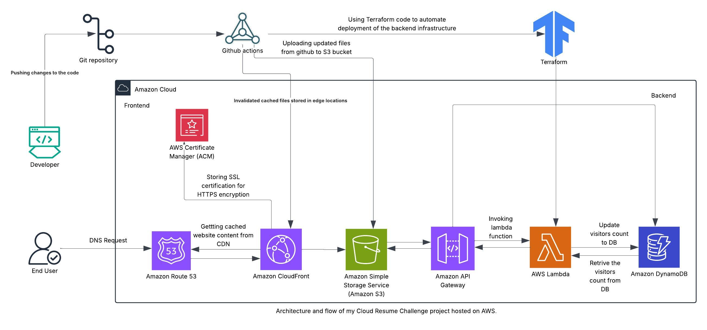

# AWS-CloudResume

This project is my implementation of the Cloud Resume Challenge, a hands-on project that showcases cloud skills using AWS services, Infrastructure as code, CI/CD pipelines, and frontend/backend integration.

# Project Overview
The Cloud Resume Challenge involves creating and hosting a static website on AWS S3 using HTML, CSS, JavaScript, and securing it with HTTPS using AWS Certificate Manager, and serving it globally with CloudFront. Registering a domain and managing DNS using Route 53. Building a serverless backend with Lambda and DynamoDB to track visitor count. Connecting the frontend and backend using an API Gateway.Implementing CI/CD pipelines with GitHub Actions.Managing infrastructure with Terraform (Infrastructure as Code).

## Live Website
[View it live here!](https://anusha-cloud-resume.com)

# Github Structure
* github/workflows/deploy-lambda.yml/: For GitHub Actions workflow for Lambda deployment.
* Backend/lambda_function.py/: The visitor counter code, which is deployed on a lambda function.
* Frontend/: *index.html - It has the frontend website code.
             *style.css - For Styling, html.
             *script.js - For calling API to get the visitor count.
* Infrastructure/main.tf/: Backend infrastructure written as Terraform code.

# AWS Services Used

* Amazon S3
* CloudFront
* AWS Lambda
* API Gateway
* DynamoDB
* Route53
* Certificate Manager (ACM)
* AWS IAM

# Blog

